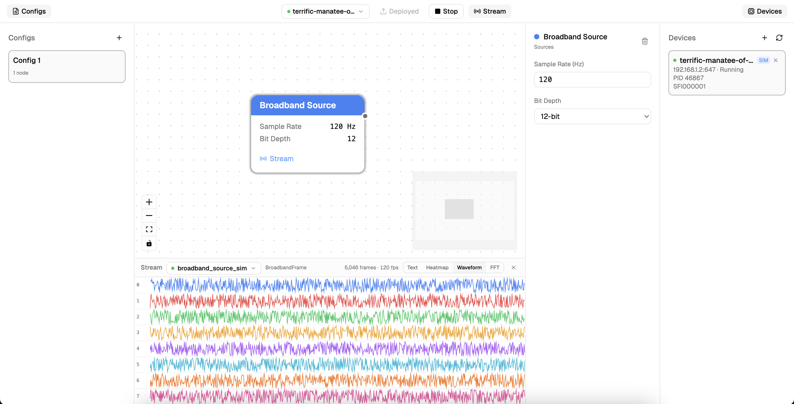

# SynapseUI

A visual interface for [Synapse](https://science.xyz/technologies/synapse) — build signal chains, manage devices, and stream data, all from your browser.

SynapseUI makes it easy to get started with Synapse by letting you spin up simulators, visually wire together signal processing nodes, deploy configurations to devices, and monitor live data streams — no code required.



## Demo

Try it out at [synapseui.louisarge.com](https://synapseui.louisarge.com/) — note that since it's running on a remote server, it won't be able to discover devices on your local network.

## Features

- **Visual signal chain editor** — Drag-and-drop node graph for building signal processing pipelines (Broadband Source, Spectral Filter, Spike Source, Optical Stimulation)
- **Simulator management** — Launch and manage Synapse device simulators directly from the UI
- **Device discovery** — Automatically discover Synapse devices on your network
- **One-click deploy** — Deploy signal chain configurations to devices with a single click
- **Live data streaming** — Stream and visualize tap data from running devices in real time
- **Config management** — Save, load, and switch between multiple signal chain configurations

## Prerequisites

- [Node.js](https://nodejs.org/) v18+
- [Python](https://www.python.org/) 3.10+
- [uv](https://docs.astral.sh/uv/) (Python package manager)

## Setup

### Backend

```bash
cd backend
uv sync
```

### Frontend

```bash
cd frontend
npm install
```

## Running

Start the backend and frontend in separate terminals:

```bash
# Terminal 1 — Backend API server
cd backend
uv run uvicorn main:app --reload

# Terminal 2 — Frontend dev server
cd frontend
npm run dev
```

Then open [http://localhost:5173](http://localhost:5173) in your browser.

## Quick Start

1. **Launch a simulator** — Click "Devices" in the toolbar, then click "+" to spin up a local Synapse device simulator
2. **Create a config** — Click "+" in the Configs sidebar (or "New Config" on the canvas) to create a new signal chain
3. **Add nodes** — Right-click the canvas to add nodes (Broadband Source, Spectral Filter, etc.)
4. **Connect nodes** — Drag from an output port to an input port to wire nodes together
5. **Configure parameters** — Click a node to open the parameter panel and adjust settings
6. **Select a device** — Use the device dropdown in the toolbar to pick your simulator
7. **Deploy** — Click "Deploy" to push your signal chain to the device
8. **Start** — Click "Start" to begin running the signal chain
9. **Stream data** — Click "Stream" to open the live data panel and monitor tap output

## Tech Stack

| Layer    | Stack                                                                                              |
| -------- | -------------------------------------------------------------------------------------------------- |
| Frontend | React 19, TypeScript, Vite, [React Flow](https://reactflow.dev/), Zustand, Tailwind CSS, shadcn/ui |
| Backend  | Python, FastAPI, Uvicorn, [science-synapse](https://science-corporation.github.io/synapse/)        |
